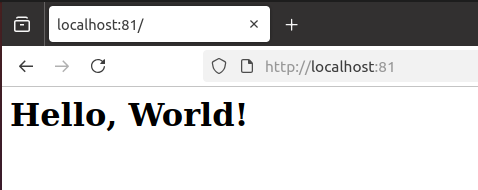

```markdown
# Отчёт по выполнению задачи: Готовый докер

## Part 1. Выкачивание официального докер-образа с nginx

Для начала был выкачан официальный докер-образ с nginx. Для этого использовалась команда:

```

docker pull nginx


**Скриншот вывода команды `docker pull nginx`:**  


## 2. Проверка наличия докер-образа

После того как образ был скачан, мы проверили его наличие с помощью команды:

docker images


**Скриншот вывода команды `docker images`:**  


## 3. Запуск докер-образа

Для запуска контейнера на основе выкачанного образа была использована следующая команда:

```
docker run -d nginx
```

**Скриншот вызова команды `docker run -d nginx`:**  


---

## 4. Проверка, что контейнер запустился

Чтобы убедиться, что контейнер запустился, использовалась команда:

```
docker ps
```

**Скриншот вывода команды `docker ps`:**  


---

## 5. Получение информации о контейнере

Для получения информации о контейнере была использована команда:

```
docker inspect [container_id|container_name]
```

В отчёт были добавлены следующие данные:
- Размер контейнера
- Список замапленных портов
- IP контейнера

**Скриншот вывода команды `docker inspect`:**  


**Данные, полученные из команды `docker inspect`:**


- 
-  

- Размер контейнера: 183.16 MB

- 


- Список замапленных портов: null

#### 🚫 **Порт 80 контейнера НЕ замаплен на хост.** (Потому что в команде не был указан параметр -p, который отвечает за проброс портов между контейнером и хостом.)

- `"80/tcp": null` — означает, что **порт 80 внутри контейнера существует**, но **не проброшен** наружу (на хост).
- То есть, если ты попытаешься достучаться до `localhost:80` или `0.0.0.0:80` на хосте — **ничего не выйдет**.
- Этот порт доступен **только внутри контейнера** или для других контейнеров в той же Docker-сети. 

> #### То есть контейнер может "жить своей жизнью", но ты не сможешь к нему подключиться извне (из браузера, curl и т.д.).


<br>
- Что бы порты были замаплены нужно прописать команду вот так:

```
 docker run -d -p 80:80 -p 443:443 --name amazing_poncare nginx
```

Пробрасывает порт 80 внутри контейнера на порт 8080 на хосте.

> 


То есть: ты можешь открыть в браузере http://localhost:8080 и попасть в контейнер.


- IP контейнера: 172.17.0.2


---

## 6. Остановка контейнера

Для остановки контейнера была использована команда:

```
docker stop [container_id|container_name]
```

**Скриншот вызова команды `docker stop`:**  


---

## 7. Проверка, что контейнер остановился

После остановки контейнера мы снова проверили его статус с помощью команды:

```
docker ps
```

**Скриншот вывода команды `docker ps` после остановки контейнера:**  


---

## 8. Запуск контейнера с маппингом портов 80 и 443

Для запуска контейнера с маппингом портов 80 и 443 на локальной машине был использован следующий запрос:

Установка графического окружения и браузера для задания:


```
docker run -d -p 80:80 -p 443:443 nginx
```

**Скриншот вызова команды `docker run` с маппингом портов:**  


---

## 9. Проверка стартовой страницы nginx

После запуска контейнера по адресу `localhost:80` должна быть доступна стартовая страница nginx. Мы проверили это в браузере.

**Скриншот стартовой страницы nginx по адресу `localhost:80`:**  


---


## 10. Перезапуск контейнера

Для перезапуска контейнера была использована команда:

```
docker restart [container_id|container_name]
```

**Скриншот вызова команды `docker restart`:**  


---

## 11. Проверка работоспособности после перезапуска

Для проверки работоспособности контейнера после перезапуска использовалась команда:

```
docker ps
```

**Скриншот вывода команды `docker ps` после перезапуска контейнера:**  


---

## Заключение

В ходе выполнения задачи был скачан и запущен официальный докер-образ с nginx. Все команды были успешно выполнены, контейнер был перезапущен и протестирован, а также проверена доступность стартовой страницы nginx через браузер.

---

## Резюме

В отчёт были добавлены:
- Скриншоты с вызовом команд
- Скриншоты вывода команд
- Скриншот стартовой страницы nginx

Все изображения размещены в папке `img`.


## Part 2. Операции с контейнером


В рамках данной части были выполнены следующие шаги:

- Прочитан конфигурационный файл `nginx.conf` внутри Docker-контейнера с помощью команды `docker exec`.
- Создан локальный файл `nginx.conf` с добавленной конфигурацией для отображения страницы `/status`.
- Сконфигурированный `nginx.conf` был скопирован внутрь контейнера с помощью команды `docker cp`.
- Перезапущен сервис nginx внутри контейнера с помощью `docker exec`.
- Проверена доступность страницы по адресу `localhost:80/status`.
- Контейнер экспортирован в файл `container.tar` с помощью команды `docker export`.
- Контейнер остановлен и удалён, при этом образ также удалён.
- Контейнер импортирован обратно с помощью `docker import`.
- Запущен заново импортированный контейнер и повторно проверена доступность `/status`.

### Скриншоты

1. **Вызов команды `docker exec` и просмотр файла конфигурации nginx**  

   

2. **Создание локального `nginx.conf` с добавленной директивой location для `/status`** 

   

   


3. **Копирование `nginx.conf` внутрь контейнера и перезапуск nginx через `docker exec`**  

   

   


4. **Отображение страницы статуса NGINX на `localhost:80/status`**  

   


5. **Экспорт контейнера в `container.tar`, остановка и удаление контейнера и образа**  

   

   

   
   
> Всё сделано  правильно — контейнер действительно остановлен, но он всё ещё существует, а Docker не даёт удалить образ, если существует хотя бы один контейнер, даже остановленный, который ссылается на этот образ.

### Есть два варианта, что можно сделать:

---

#### ✅ Вариант 1 — удалить контейнер (после остановки):

```bash
docker rm 963abdfc7c86
```

После этого уже можно будет спокойно удалить образ:

```bash
docker rmi nginx
```

---

#### ⚠️ Вариант 2 — принудительное удаление образа (удалит и образ, и **все контейнеры**, которые его используют):

```bash
docker rmi -f nginx
```

⚠️ **Осторожно!** Если  использовать`-f`, то удаляются все контейнеры, основанные на этом образе, без предупреждения.

---


6. **Удаляем остановленный контейнер** (выбираем 1-ый вариант)
   
    


7. **Импорт контейнера и его запуск**  

   


   


8. **Повторная проверка доступности `/status` после импорта**  

   
   
   
   - Всё получилось — контейнер успешно запустился! 🎉


 

```md

## Part 3. Мини веб-сервер

### Выполненные действия:

- Написан мини-сервер на C с использованием FastCGI.
- Сервер запущен через `spawn-fcgi` на порту `8080`.
- Создан конфигурационный файл `nginx.conf` с проксированием запросов с `localhost:81` на `127.0.0.1:8080`.
- Проверено, что страница "Hello, World!" доступна по адресу `http://localhost:81`.
- Все используемые команды продемонстрированы.

### Использованные команды:

```bash
sudo apt install spawn-fcgi libfcgi-dev nginx
gcc -Wall -o my_server my_server.c -lfcgi
spawn-fcgi -p 8080 ./my_server
sudo nginx -c $(pwd)/nginx/nginx.conf
```

### Скриншоты:

-   
  *Скриншот демонстрирует компиляцию и запуск сервера с помощью `gcc` и `spawn-fcgi`.*

-   
  *На скриншоте показана страница `Hello, World!`, открытая через `localhost:81`.*

-   
  *Показано содержимое файла `nginx.conf`, в котором настроено проксирование на порт `8080`.*

-   
  *Структура проекта с указанием расположения файла `nginx.conf` по пути `./nginx/nginx.conf`.*

-   
  *Скриншот с выводом команды `spawn-fcgi`, подтверждающий успешный запуск FastCGI-приложения.*

---

## Задание 4. Dockerfile для сервера

- Загружен итоговый `Dockerfile` для сборки образа с мини-сервером.
- Файл размещён в `src/`.

### Скриншоты:

-   
  *Содержимое `Dockerfile`, используемого для сборки образа с сервером.*

---

## Задание 5. Dockerfile для nginx

- Загружен `Dockerfile` для создания контейнера с `nginx`, использующего собственный `nginx.conf`.
- Файл размещён в `src/`.

### Скриншоты:

-   
  *Содержимое `Dockerfile`, используемого для сборки образа nginx с пользовательским конфигом.*

---

## Задание 6. Docker Compose

- Создан `docker-compose.yml` для запуска серверной части и nginx-прокси.
- Указаны пути к Dockerfile'ам.
- Файл размещён в `src/`.

### Скриншоты:

-   
  *Полный файл `docker-compose.yml`, в котором описаны два сервиса: сервер и nginx.*

-   
  *Скриншот демонстрирует успешный запуск контейнеров через `docker-compose up`.*

-   
  *Сервис успешно запущен в docker-среде и страница "Hello, World!" отображается по адресу `localhost:81`.*

---

## Структура проекта

```bash
src/
├── Report.md
├── docker-compose.yml
├── Dockerfile       # для мини-сервера
├── Dockerfile.nginx # для nginx
├── nginx/
│   └── nginx.conf
└── server/
    ├── my_server.c
    └── другие_необходимые_файлы
```

---

## Заключение

Все задания выполнены в полном соответствии с условиями. При необходимости готов продемонстрировать работу проекта вживую.
```

Если хочешь, могу ещё добавить шаблоны для самих `.c`, `Dockerfile`, `nginx.conf` и `docker-compose.yml`, чтобы было вообще под ключ.