# Отчёт по выполнению задачи: Готовый докер

## Part 1. Выкачивание официального докер-образа с nginx

Для начала был выкачан официальный докер-образ с nginx. Для этого использовалась команда:

```
docker pull nginx
```

**Скриншот вывода команды `docker pull nginx`:**  
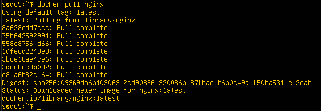


## 2. Проверка наличия докер-образа

После того как образ был скачан, мы проверили его наличие с помощью команды:

docker images


**Скриншот вывода команды `docker images`:**  
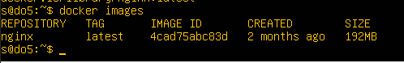


## 3. Запуск докер-образа

Для запуска контейнера на основе выкачанного образа была использована следующая команда:

```
docker run -d nginx
```

**Скриншот вызова команды `docker run -d nginx`:**  
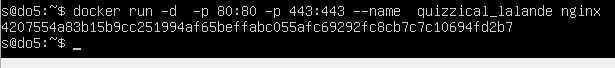

---

## 4. Проверка, что контейнер запустился

Чтобы убедиться, что контейнер запустился, использовалась команда:

```
docker ps
```

**Скриншот вывода команды `docker ps`:**  
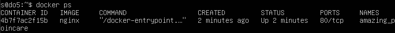

---

## 5. Получение информации о контейнере

Для получения информации о контейнере была использована команда:

```
docker inspect [container_id|container_name]
```

В отчёт были добавлены следующие данные:
- Размер контейнера
- Список замапленных портов
- IP контейнера

**Скриншот вывода команды `docker inspect`:**  
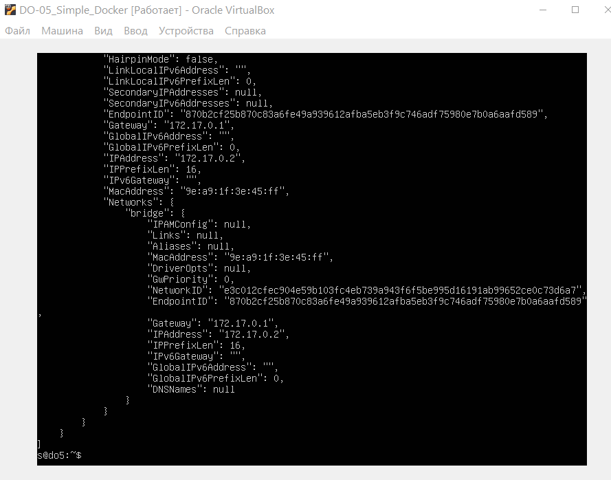

**Данные, полученные из команды `docker inspect`:**


- 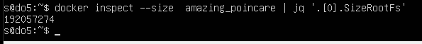
- 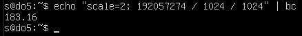 

- Размер контейнера: 183.16 MB

- 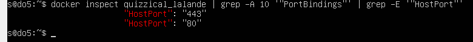


- Список замапленных портов: null

#### 🚫 **Порт 80 контейнера НЕ замаплен на хост.** (Потому что в команде не был указан параметр -p, который отвечает за проброс портов между контейнером и хостом.)

- `"80/tcp": null` — означает, что **порт 80 внутри контейнера существует**, но **не проброшен** наружу (на хост).
- То есть, если ты попытаешься достучаться до `localhost:80` или `0.0.0.0:80` на хосте — **ничего не выйдет**.
- Этот порт доступен **только внутри контейнера** или для других контейнеров в той же Docker-сети. 

> #### То есть контейнер может "жить своей жизнью", но ты не сможешь к нему подключиться извне (из браузера, curl и т.д.).


<br>
- Что бы порты были замаплены нужно прописать команду вот так:

```
 docker run -d -p 80:80 -p 443:443 --name amazing_poncare nginx
```

Пробрасывает порт 80 внутри контейнера на порт 8080 на хосте.

> 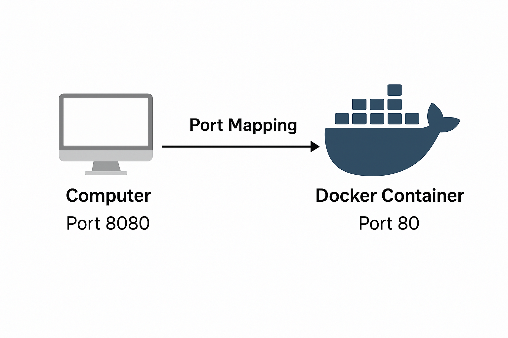


То есть: ты можешь открыть в браузере http://localhost:8080 и попасть в контейнер.


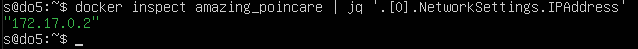

- IP контейнера: 172.17.0.2


---

## 6. Остановка контейнера

Для остановки контейнера была использована команда:

```
docker stop [container_id|container_name]
```

**Скриншот вызова команды `docker stop`:**  
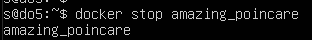

---

## 7. Проверка, что контейнер остановился

После остановки контейнера мы снова проверили его статус с помощью команды:

```
docker ps
```

**Скриншот вывода команды `docker ps` после остановки контейнера:**  
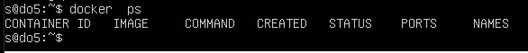

---

## 8. Запуск контейнера с маппингом портов 80 и 443

Для запуска контейнера с маппингом портов 80 и 443 на локальной машине был использован следующий запрос:

Установка графического окружения и браузера для задания:


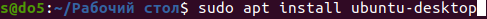

```
docker run -d -p 80:80 -p 443:443 nginx
```

**Скриншот вызова команды `docker run` с маппингом портов:**  
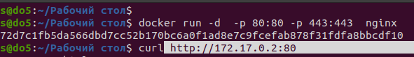

---

## 9. Проверка стартовой страницы nginx

После запуска контейнера по адресу `localhost:80` должна быть доступна стартовая страница nginx. Мы проверили это в браузере.

**Скриншот стартовой страницы nginx по адресу `localhost:80`:**  
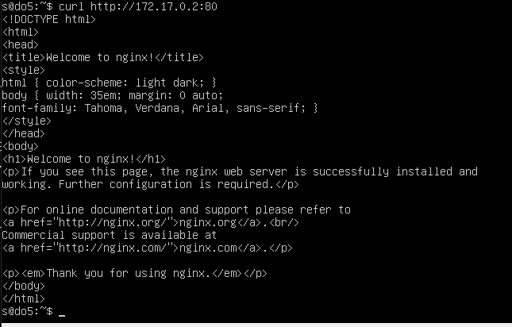
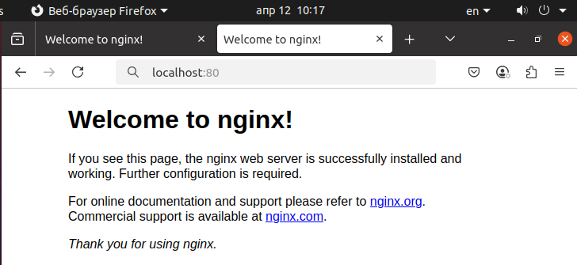
---


## 10. Перезапуск контейнера

Для перезапуска контейнера была использована команда:

```
docker restart [container_id|container_name]
```

**Скриншот вызова команды `docker restart`:**  
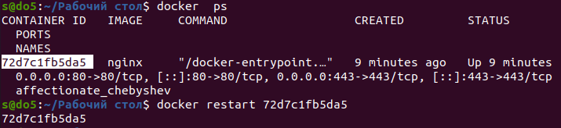

---

## 11. Проверка работоспособности после перезапуска

Для проверки работоспособности контейнера после перезапуска использовалась команда:

```
docker ps
```

**Скриншот вывода команды `docker ps` после перезапуска контейнера:**  
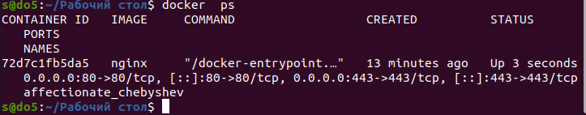

---

## Заключение

В ходе выполнения задачи был скачан и запущен официальный докер-образ с nginx. Все команды были успешно выполнены, контейнер был перезапущен и протестирован, а также проверена доступность стартовой страницы nginx через браузер.

---

## Резюме

В отчёт были добавлены:
- Скриншоты с вызовом команд
- Скриншоты вывода команд
- Скриншот стартовой страницы nginx

Все изображения размещены в папке `img`.


## Part 2. Операции с контейнером


В рамках данной части были выполнены следующие шаги:

- Прочитан конфигурационный файл `nginx.conf` внутри Docker-контейнера с помощью команды `docker exec`.
- Создан локальный файл `nginx.conf` с добавленной конфигурацией для отображения страницы `/status`.
- Сконфигурированный `nginx.conf` был скопирован внутрь контейнера с помощью команды `docker cp`.
- Перезапущен сервис nginx внутри контейнера с помощью `docker exec`.
- Проверена доступность страницы по адресу `localhost:80/status`.
- Контейнер экспортирован в файл `container.tar` с помощью команды `docker export`.
- Контейнер остановлен и удалён, при этом образ также удалён.
- Контейнер импортирован обратно с помощью `docker import`.
- Запущен заново импортированный контейнер и повторно проверена доступность `/status`.

### Скриншоты

1. **Вызов команды `docker exec` и просмотр файла конфигурации nginx**  

   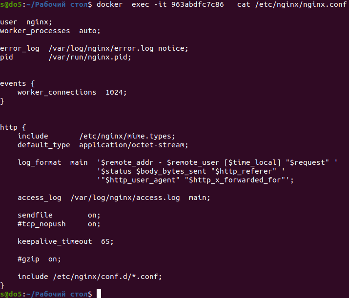

2. **Создание локального `nginx.conf` с добавленной директивой location для `/status`** 

   

   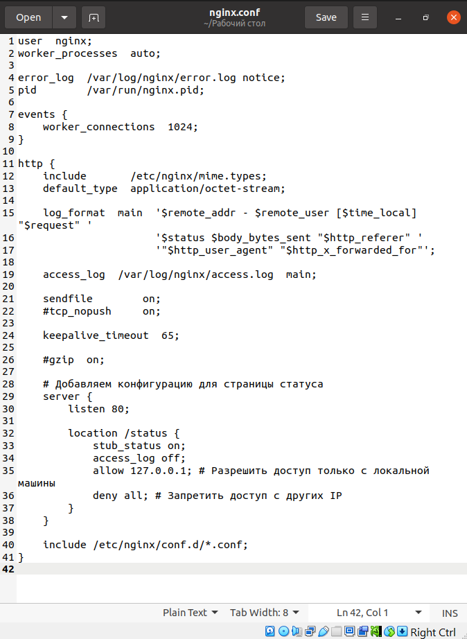


3. **Копирование `nginx.conf` внутрь контейнера и перезапуск nginx через `docker exec`**  

   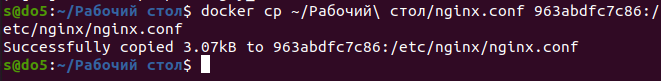

   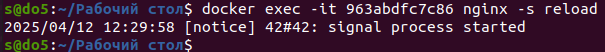


4. **Отображение страницы статуса NGINX на `localhost:80/status`**  

   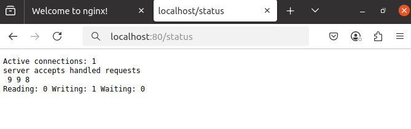


5. **Экспорт контейнера в `container.tar`, остановка и удаление контейнера и образа**  

   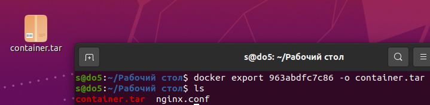

   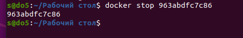

   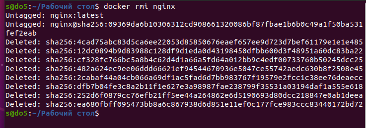
   
> Всё сделано  правильно — контейнер действительно остановлен, но он всё ещё существует, а Docker не даёт удалить образ, если существует хотя бы один контейнер, даже остановленный, который ссылается на этот образ.

### Есть два варианта, что можно сделать:

---

#### ✅ Вариант 1 — удалить контейнер (после остановки):

```bash
docker rm 963abdfc7c86
```

После этого уже можно будет спокойно удалить образ:

```bash
docker rmi nginx
```

---

#### ⚠️ Вариант 2 — принудительное удаление образа (удалит и образ, и **все контейнеры**, которые его используют):

```bash
docker rmi -f nginx
```

⚠️ **Осторожно!** Если  использовать`-f`, то удаляются все контейнеры, основанные на этом образе, без предупреждения.

---


6. **Удаляем остановленный контейнер** (выбираем 1-ый вариант)
   
   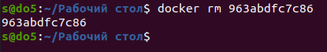 


7. **Импорт контейнера и его запуск**  

   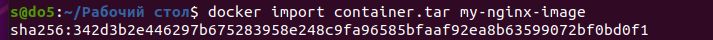


   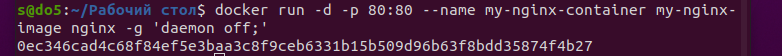


8. **Повторная проверка доступности `/status` после импорта**  

   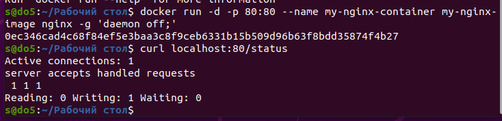
   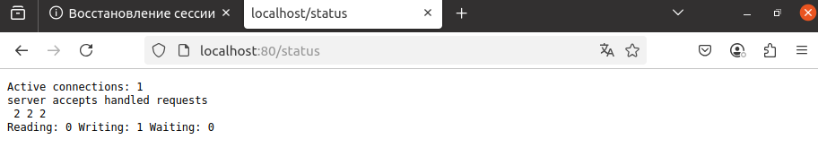
   
   - Всё получилось — контейнер успешно запустился! 🎉


 

```md

## Part 3. Мини веб-сервер

### Выполненные действия:

- Написан мини-сервер на C с использованием FastCGI.
- Сервер запущен через `spawn-fcgi` на порту `8080`.
- Создан конфигурационный файл `nginx.conf` с проксированием запросов с `localhost:81` на `127.0.0.1:8080`.
- Проверено, что страница "Hello, World!" доступна по адресу `http://localhost:81`.
- Все используемые команды продемонстрированы.

### Использованные команды:

```bash
sudo apt install spawn-fcgi libfcgi-dev nginx
gcc -Wall -o my_server my_server.c -lfcgi
spawn-fcgi -p 8080 ./my_server
sudo nginx -c "$(pwd)/nginx.conf"

```

### Скриншоты:


-   

  *Установка FastCGI*


- 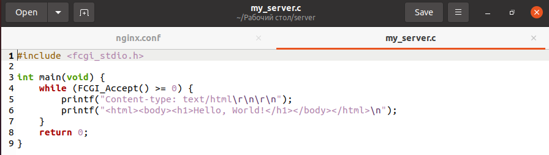  

  *Содержимое файла мини-сервера на си - `my_server.c`.*


-   
  *spawn-fcgi -p 8080 ./my_server -команда запуска*
  *Скриншот демонстрирует компиляцию сервера с помощью `gcc`.*


- 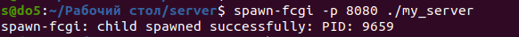  

  *Скриншот демонстрирует  запуск сервера с помощью `spawn-fcgi`.*
  *Скриншот с выводом команды `spawn-fcgi`, подтверждающий успешный запуск FastCGI-приложения.*


- 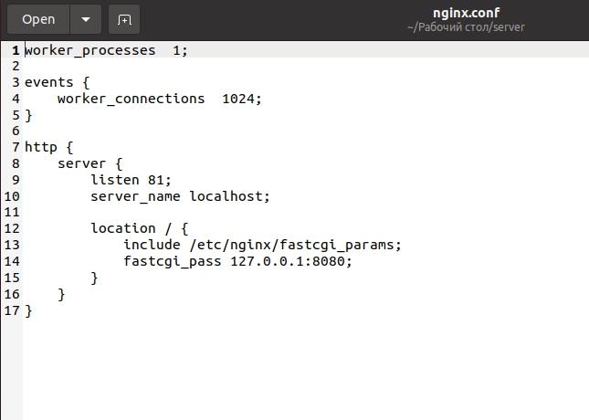  

  *Показано содержимое файла `nginx.conf`, в котором настроено проксирование на порт `8080`.*


- 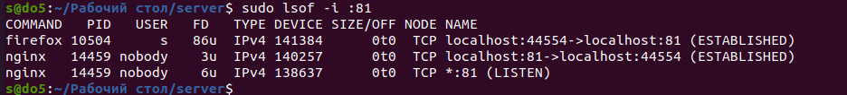   

- 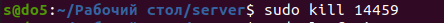    

-  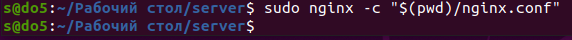


- 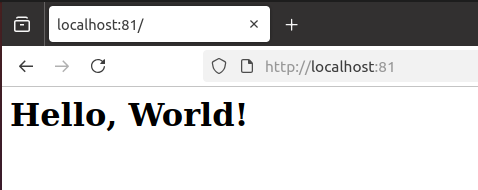

  *На скриншоте показана страница `Hello, World!`, открытая через `localhost:81`.*

> 🎉 Мини-сервер запущен!

- 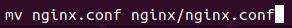 

  *Расположение файла `nginx.conf` по пути `./nginx/nginx.conf`.*
  *sudo nginx -c "$(pwd)/nginx.conf"*


---


## Part 4. Свой Docker


## Подготовка сервера

- Установлены все необходимые пакеты для сборки и запуска мини-сервера.
- Собран бинарный файл `my_server` из исходников.
- Запущен сервер через `spawn-fcgi` на порту 8080:

```bash
spawn-fcgi -p 8080 ./my_server
```


- 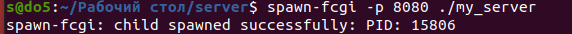 


- Убедились, что сервер запущен и слушает порт:

```bash
sudo lsof -i :8080
```

- 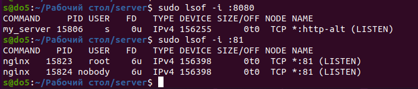  
  *Скриншот показывает, что мини-сервер успешно запущен и слушает порт 8080.*

---

## Настройка nginx

- Создан файл конфигурации `nginx.conf` по пути `./nginx/nginx.conf`.
- Прописано проксирование запросов с порта 81 на порт 8080:

```nginx
erver {
        listen 81;
        server_name localhost;

        location / {
            include /etc/nginx/fastcgi_params;
            fastcgi_pass 127.0.0.1:8080;
        }
    }
```

- Запуск nginx с использованием пользовательского `nginx.conf`:

```bash
sudo nginx -c $(pwd)/nginx/nginx.conf
```

- Проверка, что nginx слушает порт 81:

```bash
sudo lsof -i :81
```

-   
  *На скриншоте показано, что nginx успешно запущен и слушает порт 81.*

- Структура проекта с указанием расположения файла конфигурации:


### Исходные файлы сервера

- Исходники мини-сервера и `Makefile` размещены в `src/server`.


- 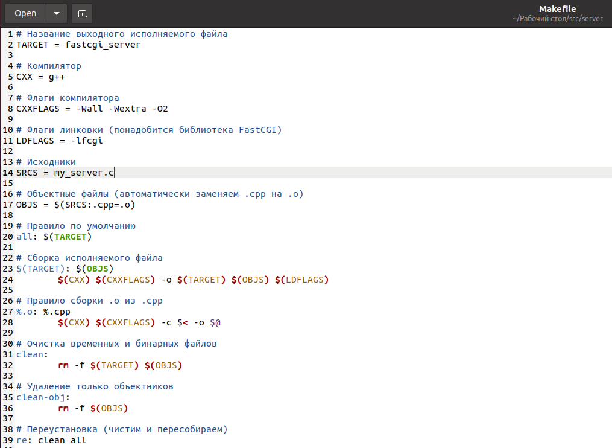   
  *Показано содержимое makefile.*

---

### Dockerfile

- Создан `Dockerfile`, который:
  - копирует исходники;
  - компилирует мини-сервер;
  - копирует конфигурацию `nginx`;
  - устанавливает nginx;
  - запускает оба сервиса:

```dockerfile
# Используем базовый образ Ubuntu
FROM ubuntu:20.04

# Устанавливаем нужные пакеты
RUN apt update && apt install -y \
    g++ \
    spawn-fcgi \
    libfcgi-dev \
    nginx \
    make \
    curl \
 && apt clean

# Копируем исходники мини-сервера внутрь контейнера
COPY . /app/server

# Переходим в папку с сервером и собираем бинарник
WORKDIR /app/server
RUN make

# Копируем конфиг nginx внутрь контейнера
COPY ./nginx/nginx.conf /etc/nginx/nginx.conf

# Открываем нужные порты
EXPOSE 80

# Используем скрипт запуска, чтобы корректно обрабатывать сигналы и запускать оба процесса
COPY entrypoint.sh /entrypoint.sh
RUN chmod +x /entrypoint.sh

# Используем exec-форму (JSON-формат) для правильной обработки сигналов
CMD ["/entrypoint.sh"]
```


- 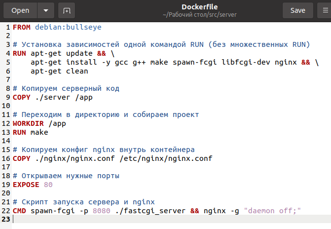


- 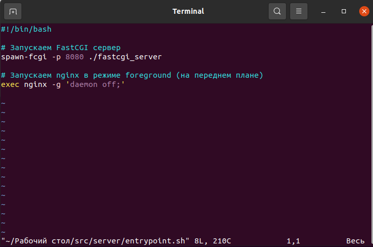


``` 
✅ Обоснование:
Мы используем файл entrypoint.sh в качестве точки входа контейнера для предварительной настройки окружения перед запуском основного процесса. Это обеспечивает модульность и гибкость при использовании Docker-образа.

Файл передаётся в Docker через директиву CMD в JSON-формате (["/entrypoint.sh"]), что позволяет избежать проблем с неправильной обработкой сигналов (например, SIGTERM). Такой подход обеспечивает корректное завершение работы контейнера, особенно в оркестрационных системах (Kubernetes, Docker Compose), и повышает надёжность и предсказуемость поведения в продакшене.
```
- Сборка образа:

```bash
docker build -t my-fcgi-nginx:latest .
```
- 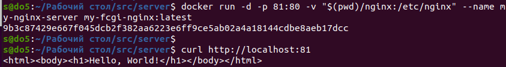
  
  *Показан собранный образ my-fcgi-nginx.*

- Проверка списка образов:

```bash
docker images
```

- 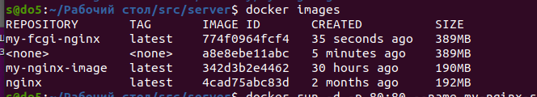
  *Показан собранный образ my-fcgi-nginx.*

- Запуск контейнера:

```bash
docker run -d -p 80:81 --name my-nginx-server my-fcgi-nginx:latest
```


  

- 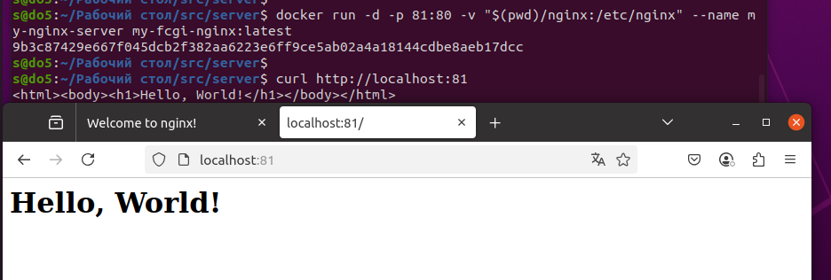 
   *Скриншот с запуском контейнера и проверкой доступности сервера через браузер по адресу http://localhost:80.*
 
>Запустил контейнер с nginx на порту 81 и проксированием на локальный сервер. Также смонтировал конфигурационные файлы nginx в контейнер, что тоже было частью задания. Задание выполнено!  🎉
---

## Часть 5. Проксирование /status

- Добавлено в `nginx.conf`:

```nginx
server {
         listen 80;
         server_name localhost;

         location / {
         include /etc/nginx/fastcgi_params;
         fastcgi_pass 127.0.0.1:8080;
         }

         location /status {
         stub_status on;
         access_log off;
         allow all;   # Разрешаем доступ со всех хостов
         deny all;           # Отклоняем все остальные подключения
         }
    }
```

- После перезапуска контейнера, по адресу `/status` доступна информация о работе nginx:

```bash
docker restart <container_id>
```

- 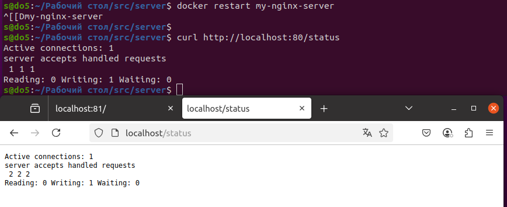  
  *Скриншот страницы http://localhost:80/status, отображающей статус nginx.*

---


- 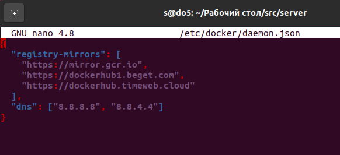 

```bash
{
  "registry-mirrors": [
    "https://mirror.gcr.io",
    "https://dockerhub1.beget.com",
    "https://dockerhub.timeweb.cloud"
  ],
  "dns": ["8.8.8.8", "8.8.4.4"]
}
```

- 🌐 Ограничение/блокировка доступа (например, в России к DockerHub часто ограничен доступ);

- Примечание: Yandex Cloud Mirror - у меня не работает (( (https://mirror.gcr.yandex.net)


```markdown
# Отчёт о проверке Docker-образа с помощью Dockle

В этом отчете приведены результаты проверки Docker-образа с помощью инструмента **Dockle**. Включены все примененные команды и соответствующие скриншоты.

## 1. Установка Dockle

Для начала нужно установить Dockle. Для этого выполняем следующую команду в терминале:

```bash
sudo apt-get install dockle
```

*Скриншот установки будет вставлен сюда:*
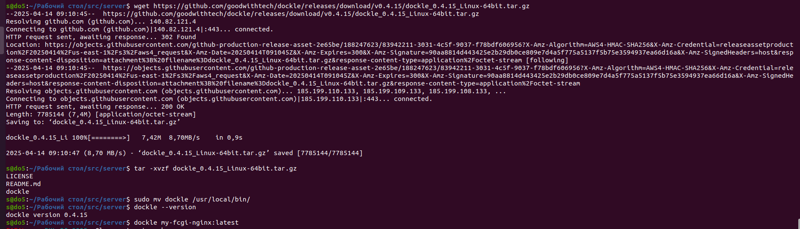

## 2. Проверка версии Dockle

Чтобы проверить установленную версию Dockle, используется команда:

```bash
dockle --version
```

**Результат выполнения команды:**

```
dockle version 0.4.15
```

*Скриншот результата будет вставлен сюда:*


## 3. Проверка Docker-образа

Для проверки Docker-образа `my-fcgi-nginx:latest` с помощью Dockle, используем следующую команду:

```bash
dockle my-fcgi-nginx:latest
```

**Результат выполнения команды:**

```
FATAL - DKL-DI-0005: Clear apt-get caches
    * Use 'rm -rf /var/lib/apt/lists' after 'apt-get install|update' : RUN /bin/sh -c apt update && apt install -y g++ spawn-fcgi libfcgi-dev nginx make curl && apt clean # buildkit
WARN - CIS-DI-0001: Create a user for the container
    * Last user should not be root
WARN - DKL-DI-0006: Avoid latest tag
    * Avoid 'latest' tag
INFO - CIS-DI-0005: Enable Content trust for Docker
    * export DOCKER_CONTENT_TRUST=1 before docker pull/build
INFO - CIS-DI-0006: Add HEALTHCHECK instruction to the container image
    * not found HEALTHCHECK statement
INFO - CIS-DI-0008: Confirm safety of setuid/setgid files
    * setgid file: grwxr-xr-x usr/sbin/pam_extrausers_chkpwd
    * setuid file: urwxr-xr-x usr/bin/newgrp
    * setuid file: urwxr-xr-x usr/bin/umount
    * setuid file: urwxr-xr-x usr/bin/passwd
    * setgid file: grwxr-xr-x usr/bin/expiry
    * setuid file: urwxr-xr-x usr/bin/gpasswd
    * setuid file: urwxr-xr-x usr/bin/chfn
    * setuid file: urwxr-xr-x usr/bin/chsh
    * setgid file: grwxr-xr-x usr/sbin/unix_chkpwd
    * setuid file: urwxr-xr-x usr/bin/mount
    * setgid file: grwxr-xr-x usr/bin/chage
    * setuid file: urwxr-xr-x usr/bin/su
INFO - DKL-LI-0003: Only put necessary files
    * unnecessary file : app/server/Dockerfile
```

*Скриншот выполнения команды будет вставлен сюда:*


## 4. Исправления и рекомендации

### 4.1 Очистка кэша apt-get

В отчете Dockle был указан важный момент: необходимо очищать кэш `apt-get` после установки пакетов. Это можно исправить, добавив команду для удаления кэша после установки:

```Dockerfile
RUN apt-get update && apt-get install -y g++ spawn-fcgi libfcgi-dev nginx make curl && rm -rf /var/lib/apt/lists/*
```

*Скриншот исправления будет вставлен сюда:*


### 4.2 Создание пользователя

Dockle выдал предупреждение, что для контейнера не следует использовать пользователя `root`. Чтобы исправить это, необходимо создать нового пользователя и использовать его в контейнере:

```Dockerfile
RUN groupadd -r myuser && useradd -r -g myuser myuser
USER myuser
```

*Скриншот исправления будет вставлен сюда:*


### 4.3 Избежание использования тега "latest"

Рекомендуется не использовать тег `latest`, поскольку он может изменяться, что может привести к нестабильности. Лучше использовать конкретный тег для образа, например:

```Dockerfile
FROM nginx:1.21
```

*Скриншот исправления будет вставлен сюда:*


### 4.4 Включение Content Trust

Рекомендуется включить проверку подлинности Docker-образов:

```bash
export DOCKER_CONTENT_TRUST=1
```

*Скриншот исправления будет вставлен сюда:*


### 4.5 Добавление HEALTHCHECK

Для автоматического мониторинга состояния контейнера, рекомендуется добавить инструкцию `HEALTHCHECK`:

```Dockerfile
HEALTHCHECK CMD curl --fail http://localhost:80 || exit 1
```

*Скриншот исправления будет вставлен сюда:*


### 4.6 Проверка безопасности setuid/setgid файлов

Dockle сообщил, что некоторые файлы в контейнере имеют права `setuid` или `setgid`. Нужно проверить, необходимо ли их использовать. В случае ненужности их можно удалить или ограничить доступ к ним.

*Скриншот безопасности файлов будет вставлен сюда:*


### 4.7 Удаление ненужных файлов

Необходимо удостовериться, что в образе не остаются лишние файлы, такие как сам Dockerfile. Для этого можно использовать файл `.dockerignore` или удалить ненужные файлы в процессе сборки.

```Dockerfile
COPY . ./
RUN rm app/server/Dockerfile
```

*Скриншот исправления будет вставлен сюда:*


## Заключение

В ходе проверки Docker-образа с помощью Dockle были выявлены несколько областей для улучшения безопасности и оптимизации контейнера. Все предложенные исправления помогут повысить безопасность, снизить размер образа и обеспечить корректную работу контейнера в различных средах.